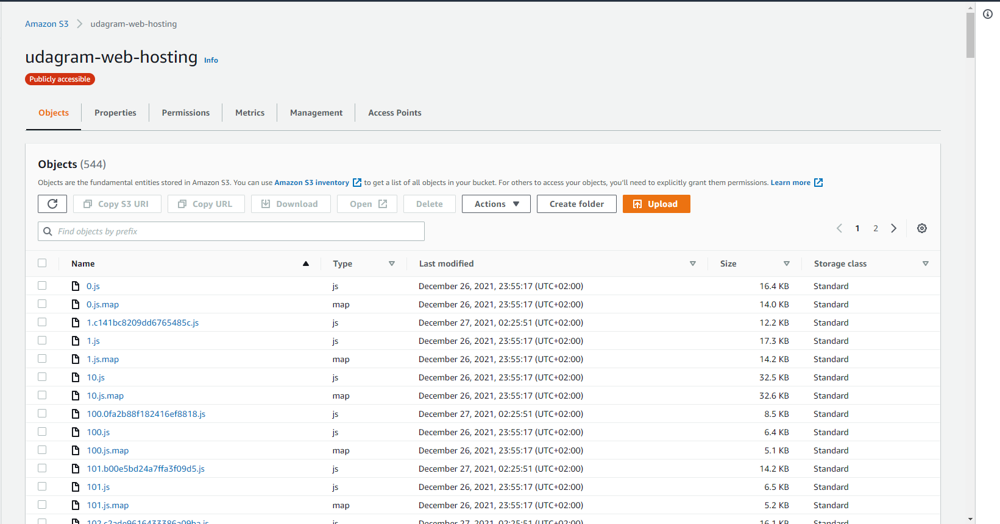

---

# Deployments Course Project

> Note: The API codebase doesn't contain any tests therefore, the test script is not added to the full test command but added in `npm run test:api`  

## Application Links

- Backend: [http://udagram-api.us-east-1.elasticbeanstalk.com/](http://udagram-api.us-east-1.elasticbeanstalk.com/)
- Frontend: [http://udagram-web-hosting.s3-website-us-east-1.amazonaws.com](http://udagram-web-hosting.s3-website-us-east-1.amazonaws.com)

## Infrastructure & Architecture

Please refer to [docs/infra.md](./docs/infra.md) to check the infrastructure documentation

## Screenshots

All Required Screenshots are available in the [images](https://github.com/atwamahmoud/devops/tree/master/images) folder. However, to quickly view them they are listed below.

### AWS Screenshots

#### RDS

#### Elastic Beanstalk

#### S3

##### Front-End files bucket `udagram-web-hosting`

##### User uploaded files bucket `udagram-user-files`

> Used for file uploads done by the back-end

### Circle CI Screenshots

#### Last Build

#### Secrets

