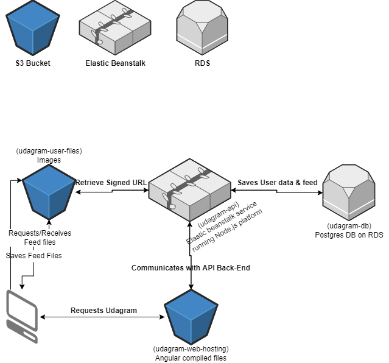

# Infrastructure

In the below diagram, the user interaction between client, Front-End, Back-End API & Database is specified.

The User receives the compiled Angular App from `udagram-web-hosting` S3 Bucket which communicates with Elastic beanstalk environment `udagram-api`.

The environment in turn communicates with an RDS postgres instance where User data & feed items are stored.

The API also generates signed PUT & GET urls of feed files for another S3 bucket `udagram-user-files` which are used by the Front-End to upload & retrieve feed files. 

