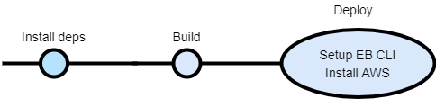

# Pipeline

CircleCI is used as the CI provider. A yaml config file can be found at `.circleci/config.yml` which defines the pipeling, its jobs & workflow.

The AWS secrets are stored on a CircleCI context called `udagram`

The pipeline is run on every push to the `master` branch & It uses the elastic beanstalk orb from CircleCI.

The pipeline also heavily uses the root `package.json` file for running common tasks like Deployment, Linting, & Installing dependencies. 

Furthermore, The pipeline makes use of `workspaces` in order to persist data between jobs.

A High-level overview of the steps done by the pipeline are as follows:

The pipeline is first initiated on each push to the `master` branch.
Once initiated the following sequence is run:

1. Dependencies are installed
1. The project is linted, if any errors appear, we exit the pipeline
2. The project is build, if any errors appear, we exit the pipeline
3. The project is deployed

In the deployment step, We first install AWS CLI to be able to use it in order to deploy the front-end to the S3 bucket.
Then We prepare the API for deployment by initializing the directory & setting the Environment variables in EB & finally we run the deploy script present at the root `package.json`

